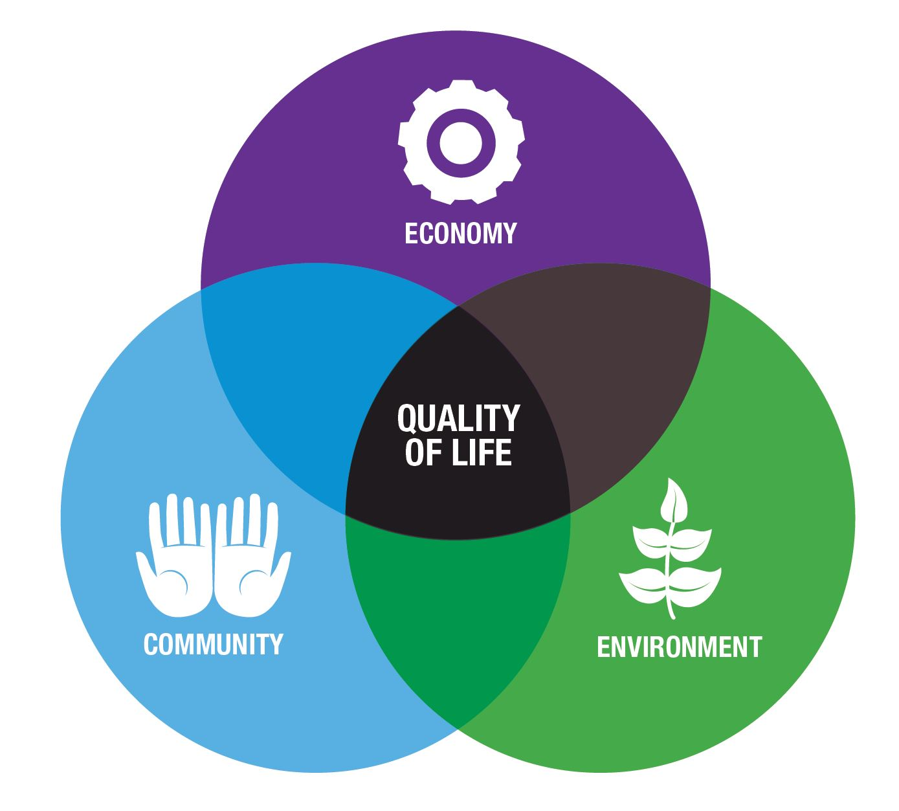

```{r, message=FALSE, warning=FALSE, echo=FALSE}
# Set R chunk default options:
# -do not output all R messages in html report
# -do not output all R warnings in html report
# -set default figure widths and heights for all code blocks, unless you 
#  override them
knitr::opts_chunk$set(
  message = FALSE, warning = FALSE, fig.width = 16/2, fig.height = 9/2
)
```

# WHY ARE WE DOING THIS?

Colonialism in Africa started in the 17th century and came to a halt in the 19th century. The colonizers in Africa were mainly European countries. This analysis starts in a world view then focuses on France, the colonizer, and Togo, the colonized. You may ask: Why Togo and France? We realized that in our studies, we often focused on where we call home or the United States in general instead of learning about other countries. Therefore, we decided to pick a country we did not know much about like Togo and explore the quality of life there in comparison to its colonizer, France.

# HOW ARE WE DOING THIS?

The first two maps we will show will be of income per person (GDP per capita) and life expectancy across the world so that we could get a rough idea of which countries we would like to focus on. Our further analysis is a line graph comparing the French and the Togolese employment rate from 2008-2018, a line graph comparing mortality rates per 1000 births in children under the age of five from 2008-2018 and lastly, there is a bar graph comparing the overall sanitation between the French and Togolese from 2008-2018. 	


{ width=5000px }

^[https://www.mainehomeconnection.com/QualityofLife]


```{r, echo = FALSE}
#loading libraries

library(ggplot2)
library(lubridate)
library(tidyr)
library(readr)
library(mapview)
library(tidyverse)
library(sf)
library(htmltools)
library(geojsonio)
library(leaflet)
library(USAboundaries)
library(maps)
library(editData)
library(sp)
library(tmaptools)
library(raster)
library(dplyr)
library(mapview)
library(readr)
```

# EXPLORING THE WHOLE WORLD

## LIFE EXPECTANCY

Life expectancy across the world varies as well. Some of the reasons will be analyzed in our further research, but in order to get a better grasp of the world, we decided that it was a good idea to create another interactive map that would allow users to roam over counties to view the life expectancy. A darker blue represents a higher life expectancy, while a lighter blue represents a lower life expectancy in comparison.


```{r, echo = FALSE}
#importing data set
life_expectancy_years <- read_csv("life_expectancy_years.csv")
#Wrangle the Countries and Years you want
new_life <- life_expectancy_years 
  
TF_life <- gather (new_life, key= "year", value= "life_expectancy", -country) %>% 
 mutate(year= as.numeric(year)) %>% 
   filter(year == 2018) 
#getting Polys in order to map
world_map <-  maps::map("world", plot = FALSE, fill = TRUE)
world_sf <- world_map %>% 
  sf::st_as_sf(crs = 4326)
world_sf <- rename(world_sf, country=ID)
world_sf <- world_sf %>%
  left_join(TF_life,by = "country")
#Actual Mapping Viz
bins <- c(0,10,20,30,50,60,80,100)
pal <- colorBin("PuRd", domain = world_sf$life_expectancy, bins = bins)
labels <- sprintf(
  "<strong>%s</strong><br/>%g years ",
  world_sf$country, world_sf$life_expectancy
) %>% lapply(htmltools::HTML)
leaflet(world_sf) %>%
  addProviderTiles("MapBox", options = providerTileOptions(
    id = "mapbox.light",
    accessToken = Sys.getenv('MAPBOX_ACCESS_TOKEN'))) %>%
  addPolygons(
  fillColor = ~pal(life_expectancy),
  weight = 2,
  opacity = 1,
  color = "white",
  dashArray = "3",
  fillOpacity = 0.7,
  highlight = highlightOptions(#for when you hover over
    weight = 3,
    color = "grey",
    dashArray = " ",
    fillOpacity = 0.3,
    bringToFront = TRUE),
    label = labels,
    labelOptions = labelOptions(
    style = list("font-weight" = "normal", padding = "3px 8px"),
    textsize = "15px",
    direction = "auto")) %>%
  addLegend(pal = pal, values = ~life_expectancy, opacity = 0.7, title = "Life Expectancy (in years)",
    position = "bottomright")
```


## INCOME 

Income across the world varies drastically to this day, therefore we decided to create an interactive map that would allow users to explore the data on their own. By scrolling over countries, you can see the GDP per capita of the country for 2018. A darker pink represents a higher GDP, while a lighter pink represents a lower GDP in comparison.

```{r, echo = FALSE}
new_income_for_world <- read_csv("new_income_for_world.csv")


#getting locations of each country
country_locations <- tibble(
  country= c("Azerbaijan", "Bahamas","Bahrain","Bangladesh","Barbados","Belarus","Belgium","Belize","Benin","Bhutan","Bolivia","Bosnia and Herzegovina","Botswana","Brazil","Brunei","Bulgaria","Burkina Faso","Burundi","Cambodia","Cameroon","Canada","Cape Verde","Central African Republic","Chad","Chile","China","Colombia","Comoros","Democratic Republic of the Congo", "Republic of the Congo","Costa Rica","Cote d'Ivoire","Croatia","Cuba","Cyprus","Czech Republic","Denmark","Djibouti","Dominica","Dominican Republic","Ecuador","Egypt","El Salvador","Equatorial Guinea","Eritrea","Estonia","Ethiopia","Fiji","Finland","Gabon","Gambia","Georgia","Germany","Ghana","Greece","Grenada","Guatemala","Guinea","Guinea-Bissau","Guyana", "Haiti","Honduras","Hungray","Iceland","India","Indonesia","Iran","Iraq","Ireland","Israel","Italy","Jamaica","Japan","Jordan","Kazakhstan","Kenya","Kiribati","Kuwait","Kyrgyz Republic","Lao","Lativa","Lebanon","Lesotho","Liberia","Libya","Lithuania","Luxembourg","North Macedonia","Madagascar","Malawi","Malaysia","Maldives","Mali","Malta","Marshall Island","Mauritania","Mauritius","Mexico","Federated States of Micronesia","Moldova","Monaco","Mongolia","Montenegro","Morocco","Mozambique","Myanmar",
"Namibia","Togo","France","Argentina", "Armenia", "Australia","Austria","Nauru","Nepal","Netherlands","New Zealand","Nicaragua","Niger","Nigeria","North Korea","Norway","Oman","Pakistan","Palau","Palestine","Panama","Papua New Guinea","Paraguay","Peru","Philippines", "Poland", "Portugal", "Qatar", "Romania", "Russia", "Rwanda","Samoa", "San Marino","Sao Tome and Principe","Saudi Arabia", "Senegal","Serbia","Seychelles", "Sierra Leone", "Singapore", "Slovak Republic", "Slovenia", "Solomon Islands", "Somalia", "South Africa", "South Korea", "South Sudan","Spain", "Sri Lanka","St. Kitts and Nevis" ,"St.Lucia", "St. Vincent and the Grenadines", "Sudan", "Suriname", "Swaziland", " Syria", "Tajikistan", "Tanzania",
"Thailand","Timor-Leste", "Togo","Tonga", "Trinidad and Tobago", "Tunisia", "Turkey","Turkmenistan", "Tuvalu", "Uganda", "Ukraine", "United Arab Emirates", "United Kingdom", "United States", "Uruguay","Uzbekistan","Vanuatu","Venezuela","Vietnam","Yemen", "Zambia", "Zimbabwe"))
```


```{r, echo = FALSE, cache=TRUE}
#leaflet map creation
country_lat_long <-
  tmaptools::geocode_OSM(country_locations$country)%>%
  as_tibble()
```


```{r, echo = FALSE}
#changing column names
country_lat_long <- country_lat_long %>% 
  mutate(country = query)
new_income <- gather(new_income_for_world, key = "year", value = "income", -country)
new_income <- new_income %>%
  filter(year == "X2019")
USA_map <-  maps::map("world", plot = FALSE, fill = TRUE)

USA_sf <- USA_map %>% 
  sf::st_as_sf(crs = 4326)
USA_sf <- rename(USA_sf, country=ID)
#joining data sets
country_lat_long <- country_lat_long %>%
  left_join(new_income,by="country")
USA_sf <- USA_sf %>%
  left_join(country_lat_long,by = "country")
bins <- c(0,100,500,600,900,1000,10000,50000,100000,500000)
pal <- colorBin("PuBuGn", domain = USA_sf$income, bins = bins)
labels <- sprintf(
  "<strong>%s</strong><br/>%g dollars ",
  USA_sf$country, USA_sf$income
) %>% lapply(htmltools::HTML)
leaflet(USA_sf) %>%
  addProviderTiles("MapBox", options = providerTileOptions(
    id = "mapbox.light",
    accessToken = Sys.getenv('MAPBOX_ACCESS_TOKEN'))) %>%
  addPolygons(
  fillColor = ~pal(income),
  weight = 2,
  opacity = 1,
  color = "white",
  dashArray = "3",
  fillOpacity = 0.7,
  highlight = highlightOptions(#for when you hover over
    weight = 3,
    color = "grey",
    dashArray = " ",
    fillOpacity = 0.3,
    bringToFront = TRUE),
    label = labels,
    labelOptions = labelOptions(
    style = list("font-weight" = "normal", padding = "3px 8px"),
    textsize = "15px",
    direction = "auto")) %>%
  addLegend(pal = pal, values = ~income, opacity = 0.7, title = "Income (in dollars)",
    position = "bottomright") 
```


