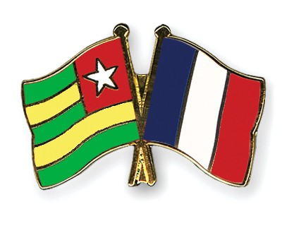

```{r, echo = FALSE}
#loading libraries

library(ggplot2)
library(lubridate)
library(tidyr)
library(readr)
library(mapview)
library(tidyverse)
library(sf)
library(htmltools)
library(geojsonio)
library(leaflet)
library(USAboundaries)
library(maps)
library(editData)
library(sp)
library(tmaptools)
library(raster)
library(dplyr)
library(mapview)
library(readr)
```

# FOCUSING ON TOGO AND FRANCE

In the following section, we will compare Togo and France. To represent Togo we used a green color, and to represent France we have used blue.

## OUR HYPOTHESIS

Our hypothesis before coding the data was that Togo will perform a lot worse than France because Togo is still effected by colonialism like the rest of Africa. Colonialism brought disease, corruption, and poverty. The greatest negative impact of colonization was the exploitation of natural resources. The French were able to capitalize off of Togo’s rich land. Togo today is the world’s largest phosphate producer. They also produce limestone, marble, fish, and coffee. In addition, colonialism set a pace for urbanization in Togo. Some of the challenges that are associated with urbanization include the growth of slums and increases in crime in urban centers. The corrupt government has tried to come up with solutions, but they have not been successful in curbing the challenges. The initiation of urbanization also facilitated rural to urban migrations which has resulted in the majority of young people migrating from rural areas to urban areas to look for jobs, leaving family behind. Lastly, poverty is also rampant, both in urban and rural areas. Such levels of poverty were not widespread in the pre-colonial days since typical Togolese tribes would work together as a community to help each other. 

## BEFORE YOU CONTINUE

We urge our readers to be more critical of international relations and look at the history of these countries. Not everything is always as it seems. Colonization still impacts countries across the world.

{ width=5000px }

## EMPLOYMENT

Next, we decided to compare the employment rate of Togo against France. This was an interesting and surprising graph until we thought and researched it further. We can see that Togo has a higher employment rate than France for ages 15+. The explanation behind this is that generally, the life expectancy in Togo is much lower, therefore not many people make it to retirement and that causes most of the population that is over 15 to work. In addition, in France the high school drop-out rate is quite low, so students from 15-19 are usually in school and do not have to work, while Togo has a very different reality. To wrap up, it is important to note that France has support for unemployed people that have a disability that is making them unemployable, while Togo does not have those resources which results in people working regardless of their circumstances.

```{r, echo = FALSE}
#importing data set

X15plus_employment <- read_csv("15plus_employment.csv")

#getting employment of Togo and France

employment_rate <- X15plus_employment %>% 
  filter(country== "Togo" | country== "France") 
   

new_employment_rate <- gather (employment_rate, key= "year", value= "employment_rate", -country) %>% 
 mutate(year= as.numeric(year)) %>% 
  filter(year >= 2008) %>% 
  filter(year <= 2018) %>% 
  mutate(new_year = lubridate::ymd(year, truncated = 2L)) %>% 
  rename(Country = country)


ggplot(data = new_employment_rate, mapping = aes(x =new_year, y = employment_rate, color= Country)) +
  geom_line(size=1) +
  labs(title= "Employment Rate of Togo and France", subtitle = "2008-2018", x= "Year", y= "Employment Rate")+
  scale_color_manual(values = c("forestgreen","blue"))

```


## MORTALITY RATE IN CHILDREN

Since we have decided to focus on Togo and France due to their colonized and colonist relationships, we decided that it would be important to portray the disparity among them when it comes to the mortality rate in children which is affected by various reasons such as income, healthcare access and coverage of basic needs. To show the large disparity, we decided to use a line graph that clearly highlights the difference between the two countries, a sad but expected finding of our project. The good news is that in the last 10 years, there has been a significant decrease in mortality in children in Togo, and France remains steady at a really low rate.

```{r, echo = FALSE}
child_mortality_rate <- read.csv(file = 'child_mortality_per_1000_born.csv')

new_child_mortality <- child_mortality_rate %>% 
  filter(country== "Togo" | country== "France") 

child_mortality <- gather(new_child_mortality, key= "year", value= "mortality_rate", -country) %>% 
  mutate(year = str_replace_all(year, "X", "")) %>% 
  mutate(year= as.numeric(year)) %>% 
  filter(year >= 2008) %>% 
  filter(year <= 2018) %>% 
  mutate(new_year = lubridate::ymd(year, truncated = 2L)) %>% 
  rename(Country = country)
 
ggplot(data = child_mortality, mapping = aes(x = new_year, y = mortality_rate, color = Country)) +
  geom_line(size=1) + 
  scale_color_manual(values = c("blue", "forestgreen"))+
  labs(x="Year", y="Mortality per 1000 live births",subtitle = "2008-2018") +
  ggtitle("Mortality rate of children under five years old in Togo and France")
```

## SANITATION

Lastly, we are aware that colonization brought about different types of diseases. Some of the diseases were not common with the local communities. The colonizers deliberately infected the local communities with different diseases to eliminate them and their livestock. Anthrax bacteria were used or put into the rivers so as to impoverish the locals by reducing their population and their animals. 
With this in mind, we decided to examine overall access to sanitation services. There is a significant difference between Togo and France. France’s access is close to 100%, while Togo’s access is well under 15%.


```{r, echo = FALSE}
overall_sanitation <- read_csv("overall_sanitation.csv")
togo_france_sanitation <- overall_sanitation %>%
  filter(country == "Togo" | country == "France" ) 
  
new_sanitation_rate <- gather(togo_france_sanitation, key= "year", value= "sanitation", -country)

#creating the bar plot
togo_france_sanitation <- new_sanitation_rate %>%
  filter(year == "2015"  )
togo_france_sanitation <- togo_france_sanitation %>%
  mutate(new_year = lubridate::ymd(togo_france_sanitation$year, truncated = 2L))
ggplot(data = togo_france_sanitation, mapping = aes(x = country, y = sanitation, fill= country, subtitle = 2008-2018)) + 
  geom_col() + scale_fill_manual(values=c("#0000ff", "#228b22")) + ggtitle("Overall Access to Sanitation Services") +  labs(y="Sanitation", x = "Country")
```


# FINAL THOUGHTS

After completing our projects, we have realized our hypothesis was not far from true, and that the disparity among states across the world is still very visible. It is important that we note their difference in access to a better quality of life, but it is even more important to understand what has led countries to that. A really common pattern is colonization, and our project has made it clear that the world is still in a decolonization process.


# CITATION

We have used Gapminder (https://www.gapminder.org/data/) for our project, and have used their indicator data for our project overall. We are bound by the Terms of Use: https://docs.google.com/document/pub?id=1POd-pBMc5vDXAmxrpGjPLaCSDSWuxX6FLQgq5DhlUhM
WE HAVE READ, UNDERSTAND AND AGREE TO BE BOUND BY THE TERMS. By accessing or using any Website or Service we also represent that we have the legal authority to accept the Terms on behalf of ourselves.

